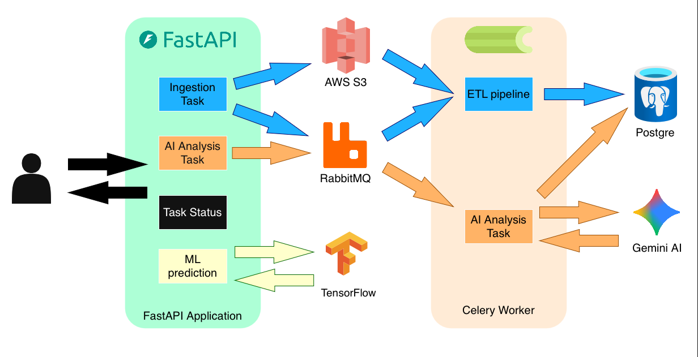

# ML-Powered Taxi Service API

This project is a machine learning-powered web service for taxi demand prediction, built with FastAPI, Celery, and Docker. It provides endpoints for data ingestion, asynchronous task processing, and ML-based predictions.

## Features

- **Data Ingestion:** Upload data files for processing.
- **Asynchronous Task Processing:** Uses Celery and RabbitMQ to handle long-running tasks in the background.
- **Machine Learning Predictions:** Predicts taxi surcharges based on input features.
- **Screenshot Analysis:** Analyzes screenshots for data extraction.
- **Cloud Integration:** Uses AWS S3 for file storage.
- **Containerized:** Fully containerized with Docker for easy setup and deployment.

## Technologies Used

- **Web Framework:** FastAPI, Uvicorn
- **Database:** PostgreSQL, SQLAlchemy
- **AI/ML:** TensorFlow, Scikit-learn, Pandas, NumPy, Google GenAI
- **Cloud/Infra:** Docker, AWS S3, Celery, RabbitMQ
- **Other:** PyArrow, Pydantic, python-dotenv

## Architecture



## Installation

### With Docker (Recommended)

1.  **Clone the repository:**
    ```bash
    git clone <repository-url>
    cd <repository-name>
    ```

2.  **Set up environment variables:**
    Create a `.env` file from the `.env.example` and fill in the required values for AWS, database, etc.

3.  **Build and run with Docker Compose:**
    ```bash
    docker-compose up --build
    ```
    The application will be available at `http://localhost:8000`.

### Local Setup (Without Docker)

1.  **Clone the repository:**
    ```bash
    git clone <repository-url>
    cd <repository-name>
    ```

2.  **Create and activate a virtual environment:**
    ```bash
    python3 -m venv .venv
    source .venv/bin/activate
    ```

3.  **Install dependencies:**
    ```bash
    pip install -r requirements.txt
    ```

4.  **Set up environment variables:**
    Create a `.env` file from the `.env.example` and fill in the required values.

5.  **Run the application:**
    ```bash
    uvicorn main:app --reload
    ```
    The application will be available at `http://localhost:8000`.

## API Endpoints

### `GET /`

Returns the status of the API.

-   **Input:** None
-   **Output:**
    ```json
    {
      "status": "API is active"
    }
    ```

### `POST /ingest`

Ingests a data file for asynchronous processing.

-   **Input:** `multipart/form-data` with a `file` field containing the data file.
-   **Output:**
    ```json
    {
      "status": "task_dispatched",
      "task_id": "e.g., a0b1c2d3-e4f5-g6h7-i8j9-k0l1m2n3o4p5"
    }
    ```

### `GET /task-status/{task_id}`

Checks the status of a background task.

-   **Input:** `task_id` (string) as a path parameter.
-   **Output (Example for a successful task):**
    ```json
    {
      "task_id": "a0b1c2d3-e4f5-g6h7-i8j9-k0l1m2n3o4p5",
      "status": "success",
      "result": {
        "message": "Screenshots analyzed and data stored successfully"
      }
    }
    ```
-   **Output (Other statuses):** The `status` field can be `pending`, `failure`, etc., with an `error` field if applicable.

### `POST /analyze-screenshots`

Starts an analysis of two uploaded screenshots.

-   **Input:** `multipart/form-data` with two file fields: `screenshot1` and `screenshot2`.
-   **Output:**
    ```json
    {
      "message": "Analysis started",
      "task_id": "a0b1c2d3-e4f5-g6h7-i8j9-k0l1m2n3o4p5",
      "check_status_url": "/status/a0b1c2d3-e4f5-g6h7-i8j9-k0l1m2n3o4p5"
    }
    ```

### `POST /predict/extra`

Predicts if a trip has an extra surcharge based on trip details.

-   **Input:** JSON body with the following fields:
    ```json
    {
      "tpep_pickup_datetime": "2023-10-27T17:30:00",
      "trip_distance": 2.5,
      "trip_duration_minutes": 15.5,
      "fare_amount": 12.50,
      "pickup_location_id": 161
    }
    ```
-   **Output (Success):**
    ```json
    {
      "status": "success",
      "prediction": "It has extra surcharge",
      "probability": 0.85
    }
    ```
-   **Output (Failure):** HTTP 500 with a JSON body like:
    ```json
    {
      "detail": "Prediction failed: ..."
    }
    ```

## Workflows

### Data Ingestion (`/ingest`)

1.  The API receives a file via a POST request to the `/ingest` endpoint.
2.  The file is uploaded to an AWS S3 bucket.
3.  A task with the S3 file link is sent to a Celery worker.
4.  The Celery worker downloads the file from S3.
5.  The worker performs an ETL (Extract, Transform, Load) process on the data.
6.  The transformed data is uploaded to a PostgreSQL database.

### Screenshot Analysis (`/analyze-screenshots`)

1.  The API receives two screenshots via a POST request to the `/analyze-screenshots` endpoint.
2.  The screenshots are uploaded to an AWS S3 bucket.
3.  A task with the S3 links for both screenshots is sent to a Celery worker.
4.  The Celery worker downloads the screenshots from S3.
5.  The worker sends the screenshots to an external AI service API for analysis.
6.  The worker receives a structured response from the AI service.
7.  The structured response is uploaded to a PostgreSQL database.

## Celery Worker Details

The `worker.py` file defines the background tasks that are executed by Celery workers. These tasks handle the heavy lifting of data processing and AI analysis, ensuring the API remains responsive.

### Task: `upload_file`

This task orchestrates the entire data ingestion workflow for a single file.

-   **Description:** Triggered after a file is uploaded via the `/ingest` endpoint. It downloads the file from S3, runs it through a complete ETL (Extract, Transform, Load) pipeline, and updates the database.
-   **Input Parameters:**
    -   `s3_key` (str): The S3 object key for the uploaded file (e.g., `taxi-data/yellow_tripdata_2023-01.parquet`).
    -   `version_id` (str, optional): The specific version ID of the S3 object to process.
-   **Core Logic (`worker.py`):**
    1.  Calls `download_to_bytes` to fetch the file from S3 and load it into an in-memory `BytesIO` buffer.
    2.  Calls `ingest_buffer_pipeline` to perform the main data processing.
    3.  Calls `check_and_upload_dims` to ensure related dimension tables are populated.
-   **Key Sub-function: `ingest_buffer_pipeline` (in `services/ingestion.py`)**
    -   **Input:** An in-memory `BytesIO` buffer, the filename, and the S3 version ID.
    -   **Process:**
        1.  **Artifacts:** Generates a unique `file_id`, calculates an MD5 `checksum`, and extracts the `period` (e.g., "2023-01-01") from the filename.
        2.  **ETL:** Reads the file (Parquet or CSV) into a Pandas DataFrame, cleans it using the `clean_df` function, and adds the `source_file_id`.
        3.  **Database Load:** Uses a high-speed `COPY`-based method (`psql_insert_copy`) to load the DataFrame into a temporary staging table in PostgreSQL.
        4.  **Merge:** Merges the data from the staging table into the main `nyc_taxi_trips` table.
        5.  **Metadata:** Records the outcome by inserting a record into the `file_ingestion_metadata` table.
    -   **Output:** A dictionary containing metadata from the process.
-   **Final Task Output (Success):**
    ```json
    {
      "status": "success",
      "file": "yellow_tripdata_2023-01.parquet",
      "period": "2023-01-01",
      "file_id": "...",
      "s3_key": "taxi-data/yellow_tripdata_2023-01.parquet",
      "version_id": "..."
    }
    ```
-   **Final Task Output (Error):**
    ```json
    {
      "status": "error",
      "message": "Error details..."
    }
    ```

### Task: `analyze_screenshots_task`

This task handles the analysis of two screenshots using a generative AI model.

-   **Description:** Triggered by the `/analyze-screenshots` endpoint. It downloads two images from S3, sends them to the Gemini AI for analysis, and stores the structured response in the database. The task will retry up to 3 times on failure.
-   **Input Parameters:**
    -   `s3_key1`, `s3_key2` (str): The S3 object keys for the two screenshot images.
    -   `filename1`, `filename2` (str): The original filenames of the screenshots, used for metadata.
-   **Core Logic (`worker.py`):**
    1.  Downloads the two images from S3 into memory.
    2.  Calls `read_images` to perform the analysis.
-   **Key Sub-function: `read_images` (in `services/ai.py`)**
    -   **Input:** The raw bytes and filenames for both images.
    -   **Process:**
        1.  **Image Loading:** Opens the image bytes using PIL (Pillow).
        2.  **AI Interaction:**
            - Initializes the Gemini client (`gemini-2.5-flash`).
            - Constructs a detailed prompt asking for a structured JSON output with specific fields (`screenshot1_analysis`, `screenshot2_analysis`, `comparison_analysis`, `future_perspectives`).
            - Sends the prompt and the two images to the Gemini API.
        3.  **Response Handling:** Parses the JSON from the model's response.
        4.  **Database Storage:** Inserts the structured analysis into the `gemini_analysis_results` table, linking it with the original filenames.
    -   **Output:** A dictionary containing the analysis results.
-   **Final Task Output (Success):**
    ```json
    {
      "status": "success",
      "analysis": {
        "screenshot1_analysis": "...",
        "screenshot2_analysis": "...",
        "comparison_analysis": "...",
        "future_perspectives": "..."
      },
      "message": "Structured analysis completed and stored in database"
    }
    ```

## Project Structure
```
.
├── docker-compose.yml
├── Dockerfile
├── main.py             # FastAPI application entrypoint
├── requirements.txt
├── celery_config.py    # Celery configuration
├── worker.py           # Celery worker definitions
├── data/               # Sample data
├── model/              # Trained ML models
└── services/           # Business logic and services
    ├── ai.py
    ├── database.py
    ├── etl.py
    ├── health.py
    ├── ingestion.py
    ├── ml.py
    ├── s3.py
    └── tables.py
```

## Contributing

Contributions are welcome! Please feel free to submit a pull request.
